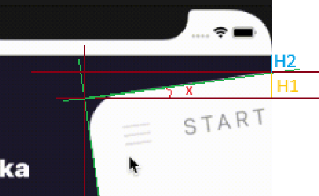

# Result


# Explanation

*Screen: Whenever I say this, I refer the main screen with header and content included (excluding the drawer)*

First, we need to notice that it's not actually behind the screen, it's just side by side. The rotated screen and the lack of margin on the right side of the drawer it's what makes it look like the screen is above it.

Before applying any animations we just need to focus on the final goal. The animations will be an extra once we know what moved.

There are three things here:

- Rotating the screen
- Reducing the screen's top margin
- Increasing the drawer's top margin

**Reducing the screen's top margin** and **Increasing the drawer's top margin** are simple tasks and we only need to pay attention that the screen stay inside the safe areas at all time.

### Rotating the screen

Since, the responsiveness is not totally clear, I'll just assume the fixed values of this rotation.

The effect of having the drawer behind the screen is stronger the closer the rotated top left screen's corner is to the drawer and to make it look like the GIF we'll want the intersection points to have fixed heights and find the angle to perform the rotation:



Here, **H1** and **H2** are fixed values we can come up with as long as it look similar to the GIF.

**x** is going to be the angle we need to find and the horizontal line of the triangle that's in the image is going half the width of the screen (the drawer will have half the screen also, just by looking at the GIF)

Since in the image we mark a right triangle we know we can apply the formula to find the angle:

$`tan(x) = H1 \over (width \over 2)`$

Which results in

$$ x = arctan({(H1) \over ((width) \over (2))}) $$

However, this will give us the angle from the bottom of the y-axis. To fix this we subtract 90deg.

Once that's done, since the border is rounded, we'll notice that we can still move the screen further to the left.


Since, we rotated a "rectangle" (screen) the angle related to the y-axis is the same to the angle related to the x-axis.
It means the x marked in the image is the same x we just got before.

**R** here is going to be the border radius of the screen.

Now with this we can get **H2** that will be the horizontal offset to position the screen border perfectly aligned to the middle of the screen

For that we use the formula:

$$ sin(x) = {(H3) \over (R)} $$

Which translates to

$$ H3 = {(sin(x)) \over (R)} $$

and that's it, the animations just need to interpolate between the initial and final position

### Nesting navigations

For this I made sure that the header always shows the state of the drawer. 

The Tab Drawer and Stack Drawer are just secondary navigations inside the drawer. This means that every page of the drawer will have many tabs and every tab will have many stacks.

The screens are randomly generated based on a seed, so they'll always be the same unless the seed is changed.

-----------------------

This is a new [**React Native**](https://reactnative.dev) project, bootstrapped using [`@react-native-community/cli`](https://github.com/react-native-community/cli).

# Getting Started

>**Note**: Make sure you have completed the [React Native - Environment Setup](https://reactnative.dev/docs/environment-setup) instructions till "Creating a new application" step, before proceeding.

## Step 1: Start the Metro Server

First, you will need to start **Metro**, the JavaScript _bundler_ that ships _with_ React Native.

To start Metro, run the following command from the _root_ of your React Native project:

```bash
# using npm
npm start

# OR using Yarn
yarn start
```

## Step 2: Start your Application

Let Metro Bundler run in its _own_ terminal. Open a _new_ terminal from the _root_ of your React Native project. Run the following command to start your _Android_ or _iOS_ app:

### For Android

```bash
# using npm
npm run android

# OR using Yarn
yarn android
```

### For iOS

```bash
# using npm
npm run ios

# OR using Yarn
yarn ios
```

If everything is set up _correctly_, you should see your new app running in your _Android Emulator_ or _iOS Simulator_ shortly provided you have set up your emulator/simulator correctly.

This is one way to run your app — you can also run it directly from within Android Studio and Xcode respectively.

## Step 3: Modifying your App

Now that you have successfully run the app, let's modify it.

1. Open `App.tsx` in your text editor of choice and edit some lines.
2. For **Android**: Press the <kbd>R</kbd> key twice or select **"Reload"** from the **Developer Menu** (<kbd>Ctrl</kbd> + <kbd>M</kbd> (on Window and Linux) or <kbd>Cmd ⌘</kbd> + <kbd>M</kbd> (on macOS)) to see your changes!

   For **iOS**: Hit <kbd>Cmd ⌘</kbd> + <kbd>R</kbd> in your iOS Simulator to reload the app and see your changes!

## Congratulations! :tada:

You've successfully run and modified your React Native App. :partying_face:

### Now what?

- If you want to add this new React Native code to an existing application, check out the [Integration guide](https://reactnative.dev/docs/integration-with-existing-apps).
- If you're curious to learn more about React Native, check out the [Introduction to React Native](https://reactnative.dev/docs/getting-started).

# Troubleshooting

If you can't get this to work, see the [Troubleshooting](https://reactnative.dev/docs/troubleshooting) page.

# Learn More

To learn more about React Native, take a look at the following resources:

- [React Native Website](https://reactnative.dev) - learn more about React Native.
- [Getting Started](https://reactnative.dev/docs/environment-setup) - an **overview** of React Native and how setup your environment.
- [Learn the Basics](https://reactnative.dev/docs/getting-started) - a **guided tour** of the React Native **basics**.
- [Blog](https://reactnative.dev/blog) - read the latest official React Native **Blog** posts.
- [`@facebook/react-native`](https://github.com/facebook/react-native) - the Open Source; GitHub **repository** for React Native.
